# CollabSpace Final Report

## **Team Information**

* **Iman Cheema**  
  * Student Number: 1007262659  
  * Email: iman.cheema@mail.utoronto.ca  
* **Ashwin Vasantharasan**  
  * Student Number: 1007293714  
  * Email: ashwin.vasantharasan@mail.utoronto.ca  
* **Harish Umapathithasan**  
  * Student Number: 1007157274  
  * Email: harish.umapathithasan@mail.utoronto.ca

## **Video Demo**

[CollabSpace Video Demo](https://drive.google.com/file/d/1U-y7eJN4iQF1cvU5gejcR7rfAsyWpn3P/view?usp=sharing)

## **Motivation**

Collaborative studying is an essential part of post-secondary learning, but the tools students rely on often leave significant gaps in how materials are organized and shared. In practice, most study groups juggle a mix of group chats, email threads, shared drives, and scattered documents. While platforms like Google Drive and OneDrive provide storage and sharing, they lack features tailored for academic collaboration, such as course-specific groups and role-based management. Their generic folder structures also require students to manually organize files, making it difficult to maintain clear structure or quickly locate the materials they need. 

As students ourselves, we have repeatedly experienced these issues in our study groups. A PowerPoint may appear in one group chat, a PDF gets lost in an email thread, and summarized notes disappear after weeks of messages. Searching across multiple platforms for a single resource is often overwhelming, taking time and energy away from actual studying. These frustrations demonstrated the need for a more cohesive, student-centered solution. 

CollabSpace was developed to address this need. It provides a centralized, organized, and intuitive platform where study groups can collaborate effectively and manage their study materials with ease. 

## **Objectives**

The primary objective of CollabSpace is to improve the collaborative study experience for students working in study groups of any size. Secondary users include teaching assistants and student organizations that support collaborative learning by helping students stay organized and on track. 

To achieve this, CollabSpace provides:  
 

1. **Centralized resources:** All study materials are stored and organized in a shared workspace, allowing group members to access files in one place and reducing time spent searching.  
2. **Enhanced collaboration:** Real-time document editing and shared workspaces help students work together efficiently.  
3. **Increased productivity and focus:** Announcements and organized course spaces keep members aligned.  
4. **Ensuring security and reliability:** User data is protected and the platform remains stable and scalable through secure authentication, containerization, orchestration, persistent storage, monitoring, and automated CI/CD.  
5. **User-friendly experience:** Intuitive and easy-to-use navigation.

## Technical Stack

### 1\. Frontend Technologies

The frontend development utilizes React.js to create a user-friendly and responsive user interface. To implement the real-time collaborative editor the application integrates Tiptap paired with Yjs. Tiptap is a headless editor framework which interfaces with React to implement the text editor logic. Yjs is a Conflict-free Replicated Data Type (CRDT) library used for document state management across multiple users. This combination of technologies allows the application to handle real-time document updates from multiple users without conflicts.

### 2\. Backend Services

The backend is powered by Express. It implements the RESTful APIs that handle user authentication, group management, and resource routing. The resource routing includes data from both the PostgreSQL database and object storage in Digital Ocean Spaces. The backend also incorporates Hocuspocus which is a dedicated WebSocket server designed to integrate with Yjs. Hocuspocus acts as the real-time collaborative bridge for the text editor. By streaming the Yjs state updates to other clients it manages the real-time synchronization of the document. Hocuspocus also handles the persistence of document data by saving and retrieving document data from PostgreSQL.

### 3\. Data Persistence and Storage

The data management is split into two services to play to the strengths of both. PostgreSQL is utilized as the primary relation database to store structured data. It stores user credentials, study groups, group roles, announcements, and text editor data. DigitalOcean Spaces is used as object storage to store unstructured content. This is used to store data such as course slides, PDFs and images.

### 4\. Infrastructure and Orchestration

The React frontend, Express backend and PostgreSQL database are containerized through Docker. For local development, Docker Compose is used to orchestrate the three primary services in a unified environment. For production, the application containers are orchestrated through DigitalOcean Kubernetes (DOKS). Kubernetes was chosen to leverage its capabilities of auto-scaling and self-healing ensuring the platform remains reliable.

### 5\. DevOps and Monitoring

To maintain CI/CD, Github Actions is employed to create a deployment pipeline. The pipeline automates the building of Docker images and their deployment to the Kubernetes cluster. System observability is handled through DigitalOcean Monitoring which provides monitoring of CPU and memory usage.

## **Features**

### 1\. User Management

User management supports the project requirements and objectives by ensuring the application reliably manages user accounts while keeping all data secure. 

* **Registration:** Users can create new accounts by providing a username, email address, and password. Passwords are securely hashed before storage in the PostgreSQL database.   
* **Login:** Registered users can log in using their credentials to gain access to all platform features.   
* **Roles & Permissions:** Users are assigned roles, either admin or member, which control access to group-specific features. 

### 2\. Study Group Management

Study group management meets the project objectives by providing an organized, interactive workspace where users can collaborate, share resources, and work together in real time. These features simulate a real collaborative workspace that supports communication, productivity, and teamwork. 

* **Study Groups:** Users can create and join study groups using a unique generated code. The creator automatically becomes the admin, with the ability to delete the group. Members can join by entering the group code and gain access to all collaborative tools. **Course Space Pages:** Each study group has a centralized page that contains announcements, resources (File Upload & Collaborative Editing), and group settings.   
* **Announcements:** Group members can add, view, and delete announcements. Each post is timestamped and staples the author for clarity.   
* **File Upload:** Users can upload various file types, including JPEG, PDFs, PNGs, and text files.   
* **Collaborative Editing:** Real-time document editing is implemented using WebSockets, allowing multiple users to edit simultaneously, with changes reflected instantly across all sessions.  
* **Settings:** Users can view all the members in a group and leave a group. Admins have additional permissions, such as deleting the group.

### 3\. System & Monitoring

System monitoring within CollabSpace meets the course core technical requirements by integrating DigitalOcean’s built-in metrics and showing key insights directly in the frontend. This ensures visibility into the system performance and storage usage.

* **File Storage & Monitoring:** The application uses DigitalOcean’s metrics dashboard to track system performance, including CPU and memory usage, in real-time.   
* **Storage Tracking / Group Storage Insights:** File storage is monitored through DigitalOcean Spaces, which tracks the size of each uploaded file. The Course Space’s Resources page displays total storage usage per group, helping users manage space efficiently.  

### 4\. Technical Implementation

CollabSpace meets the project’s core technical requirements through containerization, orchestration, persistent storage, and cloud deployment.

* **Containerization & Orchestration:** The application is fully containerized using Docker, with separate containers for the backend, frontend, and database. Orchestration is handled through Kubernetes, ensuring reliable deployments across components.  
* **Persistent Storage:** All application data, like user accounts, study group information, uploaded resources, and collaborative edits, is stored in a PostgreSQL database. The database is initialized using the init.sql script and configured with persistent volumes to ensure data remains intact across container restarts or redeployments.   
* **Deployment:** The full application is hosted on DigitalOcean. 

### 5\. Advanced Features

Colabspace includes advanced features that enhance security, reliability, and development efficiency. 

* **Authentication/Security:** JWT (JSON Web Tokens) are used to secure user sessions and ensure only authorized users can access protected routes and features.  
* **CI/CD Pipeline:** Built a CI/CD pipeline in Github Actions that creates Docker images, pushes them to Github Container Registry (GHCR), and automatically updates the Kubernetes deployment.

## **User Guide**

This guide explains how users can navigate and use CollabSpace step by step. 

When users first access CollabSpace, they are presented with the Login Screen.

* Returning users can sign in using their registered email and password in the Login card.  
* If the email or password is incorrect, the application displays an error message indicating invalid credentials.

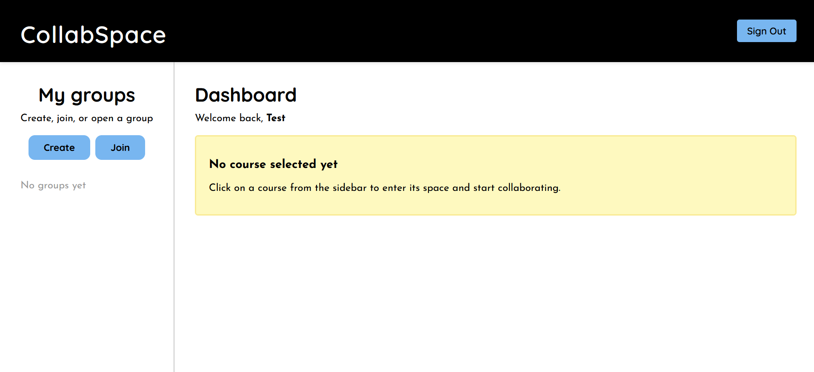

New users can create an account by clicking the Sign Up link on the Login card, redirecting them to the Registration screen. 

* Users must enter their full name, email address, and password.   
* If any required field is missing or the email is not in a valid format, the system displays an error message prompting the user to correct the information.  
* Users then click the Sign In button to create their account.

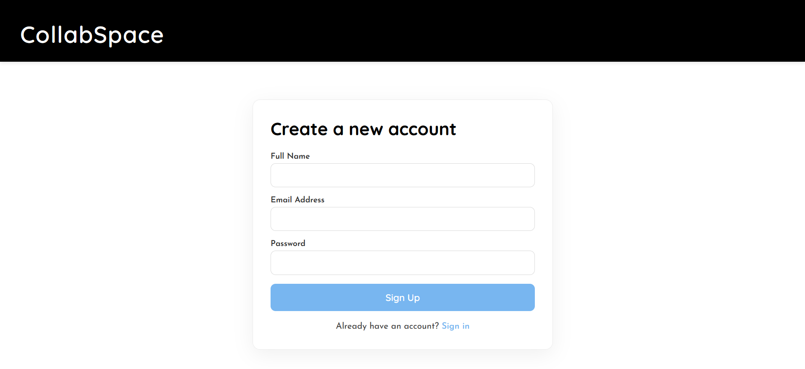

After logging in successfully, users are directed to the Dashboard screen. The left Sidebar  menu is used to manage study groups. 

* If the user has no existing groups, a message appears: “No groups yet.”

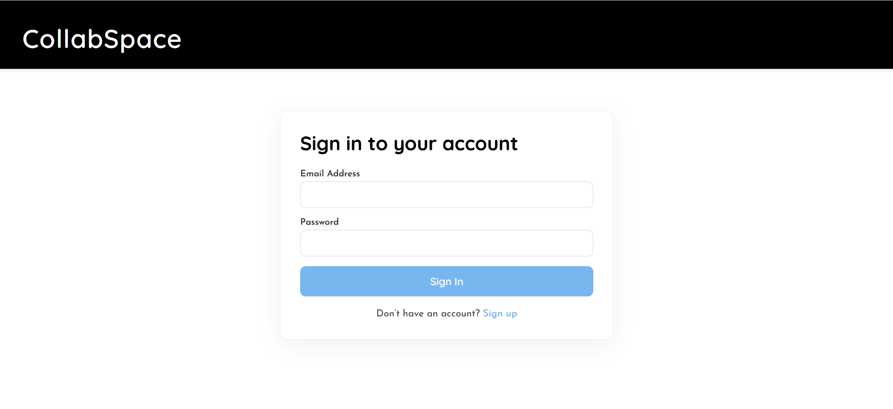

A user can click on the Create button to make a new group. This opens a popup form where they can enter a group name, add a description, generate a unique group code, and click the Create Group button to finalize the group. Once created, the new group appears in the left Sidebar.

* The user who creates the group automatically becomes the group admin and is responsible for sharing the group code with other members so they can join. 

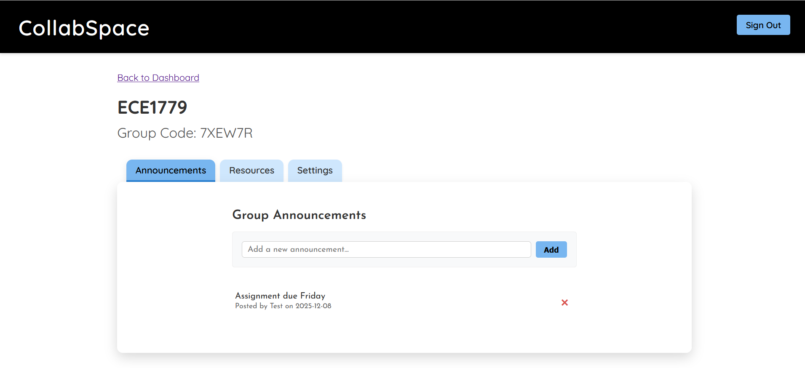

Alternatively, users can click on the Join button on the Sidebar to join an existing group. A popup appears prompting them to enter the group’s unique code and click the Join button, which will then appear in the Sidebar.

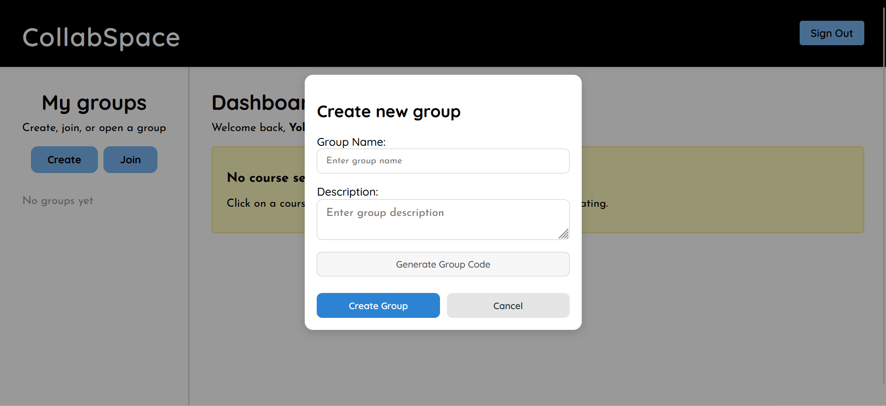  
When a user selects a group from the Sidebar, the right side of the dashboard displays the group name, group description, and a button to Enter the Group Space, which takes the user into the main collaboration workspace.

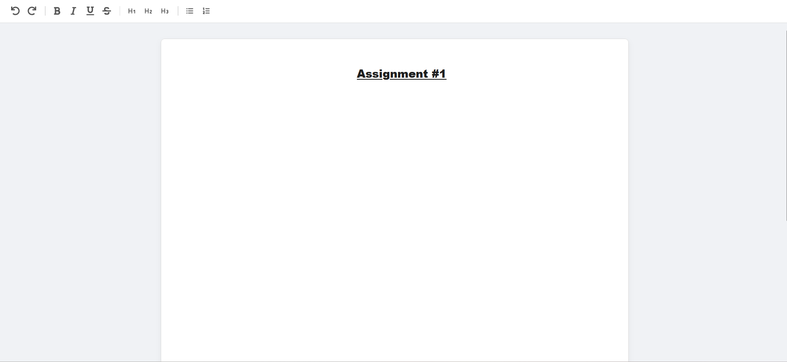

The Course Space contains three tabs (Announcements, Resources, and Settings). Each tab allows users to interact with content specific to the group. 

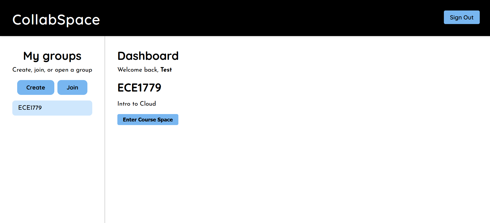

**1\. Announcements**

In the Announcements tab, users can view all announcements posted by group members.

* If no announcements exist, a message appears: ‘No announcements yet’.  
* Users can create a new announcement by entering a message in the input field and clicking the Add button.   
* Each announcement displays the author and timestamp.   
* Users can delete an announcement by selecting the red X option.


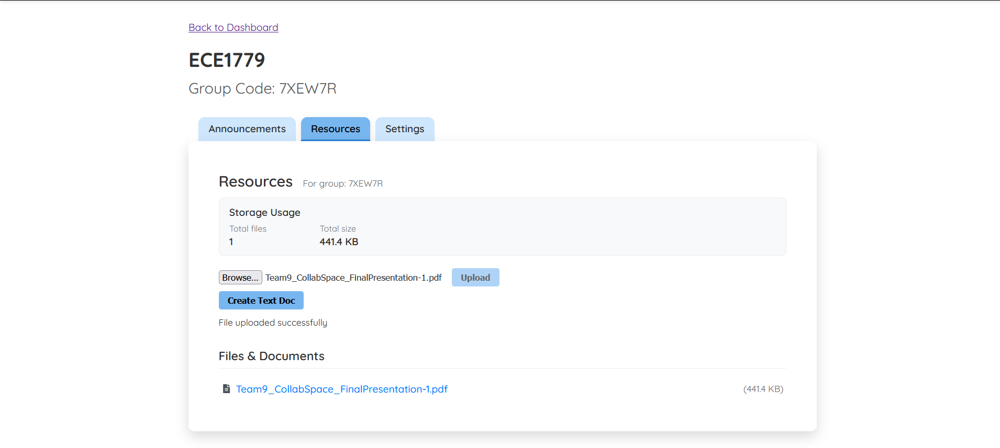

**2\. Resources**

In the Resources tab, users can access all files and documents shared by group members. 

* To upload a file, users click the Choose File button, select a file from their device, and then click Upload. The uploaded file appears in the Files & Documents section.   
* To create a shared text document, users click the Create Text Doc button. A popup opens where they can enter a document name and click Save. The new document appears in the Files & Documents list.   
* Clicking on a text document opens the editor, allowing users to edit the document in real time and use rich text formatting tools (e.g., bold, headings, lists).   
* Users can also see how much storage has been used within the group. 


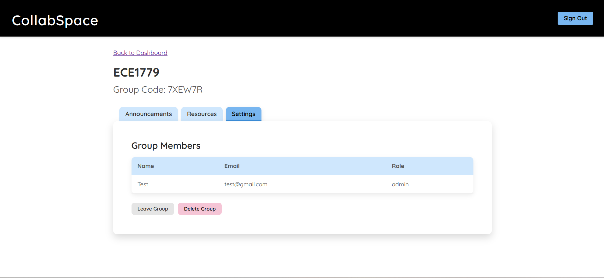 

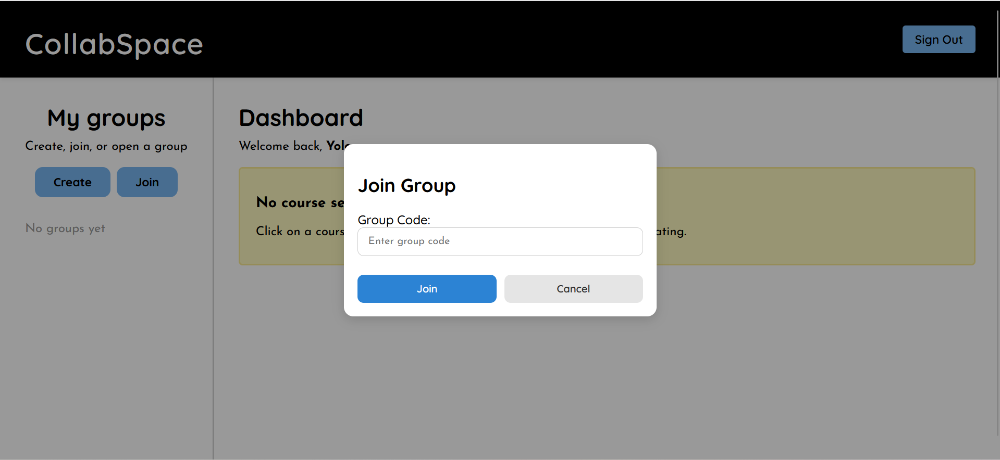

**3\. Settings**

In the Settings tab, users can manage group membership and administrative options. 

* Users can view all members of the group, including which member is the admin.  
* Every member can choose to leave the group.  
* The group admin has the ability to delete the group if necessary. 

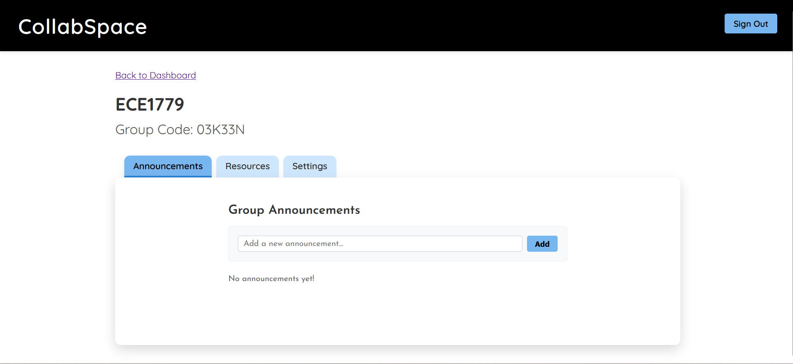

To navigate out of the Course Space, a user can click the Back to Dashboard link, where they can access other study groups. 

Lastly, clicking Sign Out in the Navbar logs the user out of the application.

## **Development Guide**

### 1\. Prerequisites and Environment Setup

The development environment relies on containerization to ensure consistency across developer devices. Before starting install:

* Docker Desktop   
  * For container management and orchestration  
* Git   
  * To clone the project repository

### 2\. Environment Configuration

To handle sensitive information such as database credentials, API keys, and storage secrets the application uses a .env configuration file.

* Create a file named.env in the root directory of the project. This file is read by the docker-compose.yml file during the build process.  
* Populate the .env file with the following keys:   
  * SPACES\_KEY, SPACES\_ENDPOINT, SPACES\_SECRET, SPACES\_BUCKET, SPACES\_REGION  
  * JWT\_SECRET  
  * POSTGRES\_PASS  
  * COLLAB\_PORT=5000, EXPRESS\_PORT=6001

### 3\. Local Deployment

Once configured the local development is managed through Docker Compose, which orchestrates the startup order and networking of the three primary containers.  
To build and run the containers run:  
```bash  
docker-compose up --build  
```

* This command builds the images for the frontend and api services using their respective Dockerfiles and pulls the `postgres` image to create the database container

### 4\. Local Testing and Access

Once the containers are running and healthy the application can be accessed via browser.

* Frontend: Navigate to [http://localhost:3000](http://localhost:3000) to access the React application.  
* Backend: The backend API can be tested at [http://localhost:5000](http://localhost:5000).  
* WebSocket: The Hocuspocus WebSocker server will be active on port 6001\.

To close down the environment run:  
```bash  
docker-compose down   
```  
To close down the environment and remove all volume data run:  
```bash  
docker-compose down -v  
```

## **Deployment Information**

The application is managed by DigitalOcean Kubernetes and is accessible at: [http://152.42.146.198/](http://152.42.146.198/). 

## **Individual Contributions**

### Ashwin

**Frontend & Backend Development (Authentication & Storage)**

* Implemented secure user authentication using JWT, including full login and registration flows.  
* Developed backend authentication endpoints:  
  * POST /auth/register — create new user accounts  
  * POST /auth/login — authenticate users and issue JWT tokens  
* Integrated secure password hashing using bcrypt and protected all sensitive backend routes using JWT.

**File Upload & Resource Management Feature**

* Developed the file upload system using DigitalOcean Spaces for object storage.  
* Implemented secure file upload endpoint:  
  * POST /files/upload — upload files to group-specific storage  
* Implemented group-based authorization logic to ensure only members can upload and access resources.  
* Integrated frontend upload UI with real-time upload status and automatic resource list refresh.

**Storage Tracking & Monitoring Feature**

* Implemented group-based resource listing and storage tracking logic.  
* Developed backend endpoint to retrieve all resources for a study group:  
  * GET /groups/:groupCode/resources — fetch all stored files and collaborative text documents  
* Implemented file size tracking and display within the Resources tab.  
* Integrated real-time storage usage visibility per group to help users manage uploaded content efficiently.

### Iman

**Frontend & Backend Development**

* Set up the React project structure and configured application routing.   
* Built core User Interface components and screens, including the Navbar, Sidebar, Dashboard, and Course Space interface, along with overall styling across the application.   
* Study Group Feature  
  * Developed Create Group and Join Group popups, integrated with backend endpoints:  
    * **POST /groups/create** — create new group  
    * **GET /groups/my** — fetch all groups the user belongs to  
    * **POST /groups/join** — join an existing group using a code  
  * Implemented dynamic sidebar group display and ensured the dashboard updates based on the selected group.  
* Settings Feature  
  * Implemented functionalities to view all group members, leave a group, and delete a group (admin-only), with backend integration using the following endpoints:   
    * **GET /groups/:groupCode/members** — view all members  
    * **POST /groups/:groupCode/leave** — leave the group  
    * **DELETE /groups/:groupCode** — delete the group

**Database & Devops**

* Created init.sql including the USERS, STUDY\_GROUPS, and USER\_GROUPS tables.  
* Set up Docker Compose (docker-compose.yml) to run the frontend, backend, and PostgreSQL services.  
* Developed and updated Backend.Dockerfile and Frontend.Dockerfile to match the project folder structure.   
* Configured PostgreSQL with persistent volumes to retain data across containers.

### Harish

**Frontend & Backend Development**

* **Collaborative Text-Editor Feature**  
  * Developed the collaborative text-editor  
  * Implemented editor UI and logic on frontend  
  * Implemented Hocuspocus on backend for editor collaboration and persistence to PostgreSQL  
  * Updated following endpoints on backend:  
    * GET /groups/:groupCode/resources — update to fetch Yjs text documents along with pre-existing Object Storage content  
  * Created following endpoints on backend:  
    * POST /groups/:groupId/textdocs — creates new study group text document  
* **Resources Tab Feature**  
  * Updated resources tab UI to show text documents alongside object storage content  
  * Added pre-signed URLs for object storage content to make it accessible within the resources list   
* **Announcements Feature**  
  * Built the Announcements tab UI  
  * Created following endpoints on backend:  
    * GET /groups/:groupCode/announcements — gets all announcements for group  
    * POST /groups/:groupCode/announcements — creates new announcement  
    * DELETE /announcements/:announcementId — deletes announcement


**Database & DevOps**

* Updated init.sql with TEXT\_DOCS and ANNOUNCEMENTS tables  
* Created Kubernetes secrets, persistent volume claims, deployments and services yamls  
* Setup DOKS with Kubernetes manifests  
* Created GitHub Actions CI/CD pipeline with image push to GHCR

Our combined efforts resulted in a fully functional application that meets all project goals and requirements, with Github commits and pull requests showing that everyone contributed equally and effectively. 

## **Lessons Learned and Concluding Remarks**

CollabSpace was designed and implemented as a secure and scalable platform to support collaborative studying. The project effectively addresses the initial problems identified in our motivation by eliminating the need for students to rely on disjointed tools such as group chats, emails, and shared drives. CollabSpace provides a unified workspace where study groups can communicate, share resources, and collaborate in real time.

From a technical perspective, the backend was built using Node.js, Express, and PostgreSQL, while the frontend was developed using React.js. The application is fully containerized using Docker and orchestrated with Kubernetes, ensuring scalability, reliability, and consistent deployment. Persistent storage is provided through PostgreSQL and DigitalOcean Spaces, and GitHub Actions automates the CI/CD pipeline.

Throughout this project, we learned the importance of starting with a clear and well-organized architecture across frontend, backend, database, containers, and deployment process. We gained hands-on experience with containerization using Docker, orchestration with Kubernetes, and workflow automation with Github Actions CI/CD pipelines. We also learned that consistent communication is essential when working as a team, since every part of the system depends on the others. These lessons were crucial in successfully designing and implementing our application. 

Overall, CollabSpace successfully fulfills both the functional and technical requirements of the project. It provides a strong foundation for future enhancements, such as file versioning and real-time chat.

