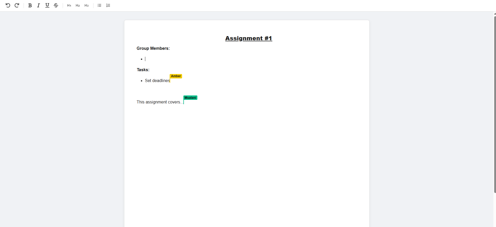

# CollabSpace

**CollabSpace** is a platform designed to streamline academic collaboration. It eliminates the friction of scattered group chats and disorganized file drives by providing course-specific workspaces, real-time document editing, and structured resource management.

## Key Features

* **Real-time Collaborative Editing:** Multi-user document editing powered by Tiptap and Yjs (CRDTs) via WebSockets.
* **Study Group Management:** Create or join groups using unique codes with role-based access (Admin/Member).
* **Resource Center:** Integrated file storage for PDFs, images, and notes, featuring group-level storage tracking.
* **Group Communications:** Dedicated announcement boards with author attribution and timestamps.
* **Secure Infrastructure:** JWT-based authentication, containerized services, and automated CI/CD pipelines.


## Application Screenshots

| Dashboard | Create Group |
| :---: | :---: |
|  <br> *Centralized view of study groups* |  <br> *Easy group creation* |

| Collaborative Editor | Course Resources |
| :---: | :---: |
|  <br> *Real-time collaboration* |  <br> *File storage and tracking* |


## Technical Stack

| Component | Technology |
| :--- | :--- |
| **Frontend** | React.js, Tiptap, Yjs |
| **Backend** | Node.js (Express), Hocuspocus (WebSockets) |
| **Database** | PostgreSQL |
| **Storage** | DigitalOcean Spaces (S3-Compatible) |
| **DevOps** | Docker, Kubernetes (DOKS), GitHub Actions |
| **Monitoring** | DigitalOcean Monitoring |


## Getting Started

### Prerequisites
* Git
* Docker Desktop

### 1. Environment Configuration
Create a `.env` file in the root directory and populate it with the following keys:

```env
# Object Storage (DigitalOcean)
SPACES_KEY=<your_key>
SPACES_SECRET=<your_secret>
SPACES_ENDPOINT=<your_endpoint>
SPACES_BUCKET=<your_bucket>
SPACES_REGION=<your_region>

# Security/Database
JWT_SECRET=<your_jwt_secret>
POSTGRES_PASS=<your_db_password>

# Ports
COLLAB_PORT=5000
EXPRESS_PORT=6001
```

### 2. Local Deployment
Build and launch the application using Docker Compose:

```bash
docker-compose up --build
```

### 3. Accessing the App
* **Frontend:** `http://localhost:3000`
* **Backend API:** `http://localhost:5000`
* **WebSocket Server:** `http://localhost:6001`


## Usage Guide

1.  **Join/Create:** Use the sidebar to create a new study group or enter a code to join an existing one.
2.  **Announcements:** Post updates for your group members in the main dashboard.
3.  **Collaborate:** Navigate to **Resources** to upload files or create a **Text Doc** for real-time simultaneous editing.
4.  **Manage:** Admins can manage group members or delete the workspace via the **Settings** tab.


## Architecture & DevOps

* **Containerization:** The app is split into three main containers: `frontend`, `api`, and `db`.
* **Orchestration:** Managed by **Kubernetes** for auto-scaling and self-healing capabilities.
* **CI/CD:** GitHub Actions automates the build process, pushes images to the **GitHub Container Registry (GHCR)**, and triggers deployment to the Kubernetes cluster.
* **Persistence:** PostgreSQL uses persistent volumes to ensure data survives container restarts.